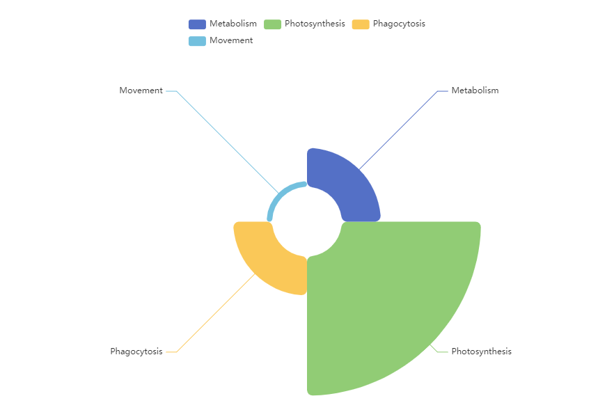
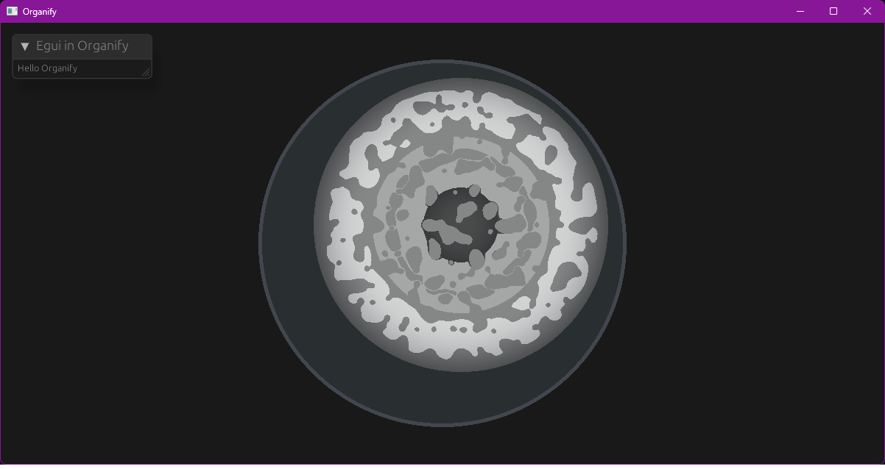

Organify
===
The `Organify` project is inspired by the [`Cell Lab`](https://www.cell-lab.net) game. 

However, there are some significant differences between the two games: 
- In Organify, there is no division into different cell types. Instead, all cells can perform all functions. This means that each cell can function as an independent organism. However, if a cell attempts to perform all functions, its performance will be less efficient. 
- The graphics in Organify are completely different from those in Cell Lab. 
- Organify has a more complex system of cell metabolism, where players must decide which substances to use and how to use them within the cell.

## Example of metabolism code
The reaction below describes what should happen to glucose in the cell. 
> `GLU` + `[Glycolysis]`

The effectiveness of this reaction depends on how strongly the metabolizer trait prevails.

## Traits
The main traits at the moment are: 
1. Photosynthesis 
2. Phagocytosis 
3. Metabolism 
4. Movement

Each trait in a cell contributes to its appearance, making the specialization of that cell more clear.

Traits of base cell:

## Approximate appearance:
